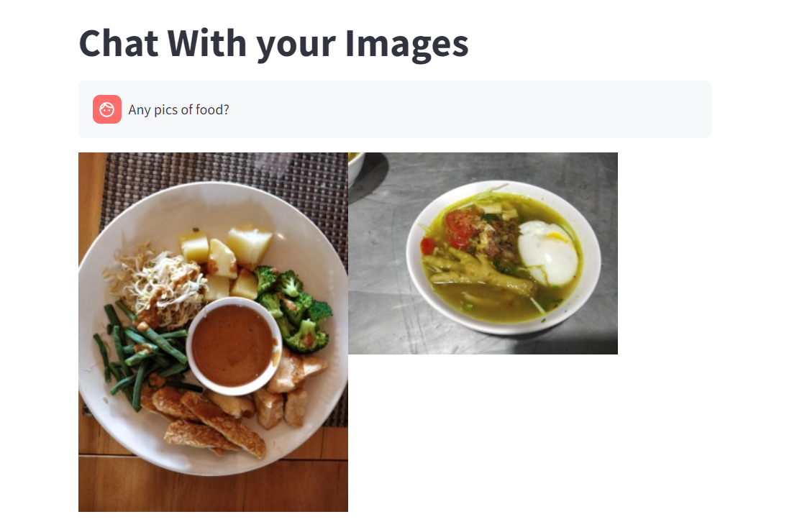
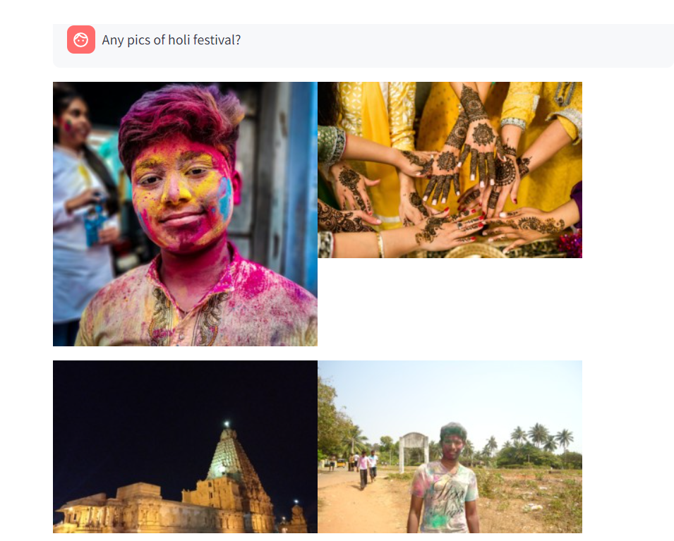

# chat-with-images

---
### TL;DR/Description
---
This is prototype to retrieve your images in your local folder with simple text. 
It was made using langchain, ollama and FIASS vector database. Front end is created by using streamlit python package.

Our project converts images to text and then to embeddings, enabling users to chat and retrieve similar pictures from their directory, enhancing image search and management.

#### Sample Chat

